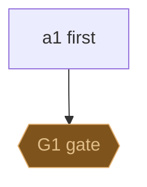

# Good plan

```mermaid
flowchart TD
  a1["a1 first"] --> G1{{"G1 gate"}}
  classDef gate fill:#7e531c,stroke:#dfad6d,color:#e1be89;
  class G1 gate;
```

## Nodes

| Node | Goal |
| --- | --- |
| a1 | First |

## Notes

For testing.
