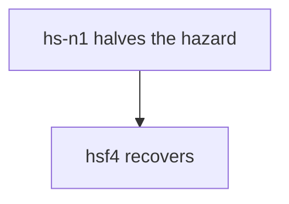

# Render bug plan

```mermaid
flowchart TD
  hs-n1["hs-n1 halves the hazard"] --> hsf4["hsf4 recovers"]
```

## Nodes

| Node | Goal |
| --- | --- |
| hs-n1 | First |

## Notes

hyphenated id echoed in a quoted label