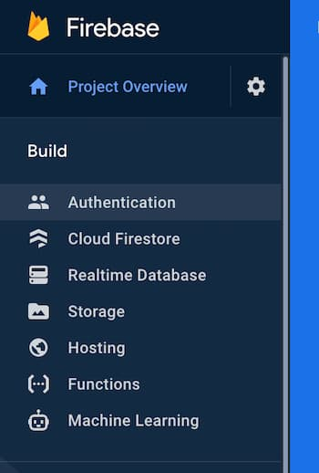

# Realness web


Realness web is the source code for [realness.online](https://realness.online). This code is a tool for you to build and maintain your own social networks.

You can moderate an instance of Realness via the [firebase console](https://firebase.google.com)

You can learn more about the [philosopy](docs/philosophy.md), [architecture](docs/architecture.md), [technical highlights](docs/highlights.md), or dive right in and get started

## Install

### Clone and install

From your favorite terminal

``` bash
$ git clone git@github.com:realness-online/web.git

$ cd web

$ yarn install

$ yarn build

$ yarn serve

```
Visit [localhost:8080](http://localhost:8080/). Large parts of the app work without having to configure firebase.

### Configure firebase

Add a project from the [firebase console](https://console.firebase.google.com). Bear in mind that the name you give your project will be it's url for your social network

``` http
https://${project-name}.web.app
```
Once your project is created you will want to enable phone authentication and file storage.

#### Enable phone authentication


#### Enable Storage

Accept the default security rules (they will be [properly configured]() when you deploy). and pick your region.

### Deploy to firebase

Install firebase-tools log in and then your ready to deploy.

``` bash
$ yarn global add firebase-tools

$ firebase login

$ yarn deploy
```

# DONE!

Visit [https://${project-name}.web.app](${name}.wep.app). You can sign in and invite your friends.

## Sign in via localhost

For a fully functioning localhost save a file named ```env.local``` to the root of your project with your projects keys.

```
VUE_APP_API_KEY=${firebase.apiKey}
VUE_APP_AUTH_DOMAIN=${firebase.authDomain}
VUE_APP_DATABASE_URL=${firebase.databaseUrl}
VUE_APP_PROJECT_ID=${firebase.projectId}
VUE_APP_STORAGE_BUCKET=${firebase.storageBucket}
VUE_APP_MESSAGING_SENDER_ID=${firebase.messagingSenderId}
```

Restart your local server and localhost has the same functionality as when you deploy.

## Contributing

Moderators are ideal committers. Setting up an instance of realness is also setting yourself up to help contribute to realness. Please read our [contribution guidlines](docs/contributing.md).

## Support

We invite you to [Join realness online](https://realness.online) if you are interested in technical support for Moderating your own instance of realness web.

## License

One instance of realness per human person. This human person is the Moderator of their instance of Realness.

A moderator takes responsibility for the content that is created within their intance of realness.

By moderating an instance of realness you become part of a chain of reponsibility that is diffuse. Each realness instance has a seperate moderator for it's users to negotiate norms with. This way, Human beings can move between networks naturally; Choosing a realness that is a good fit for them.

It is the explicit goal of realness to create a democratic enviroment where people feel free to share and communicate yet it is clear who's ass is on the line for what gets said, organized, and done.

Currently [package.json](package.json) has the licence field marked as UNLISENCED – We need to figure that license out.
